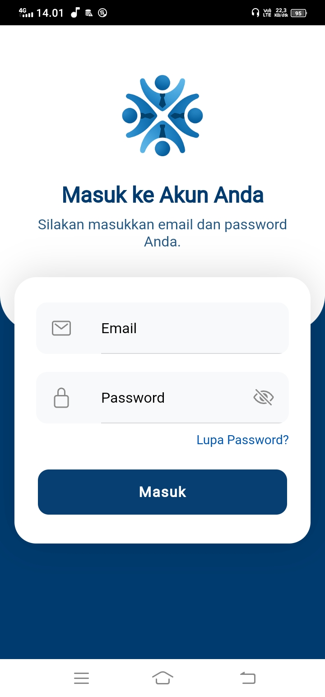
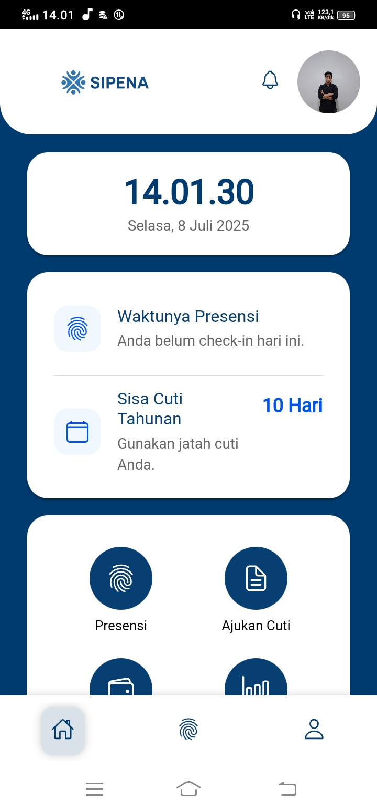
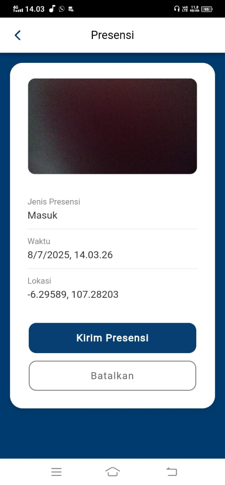
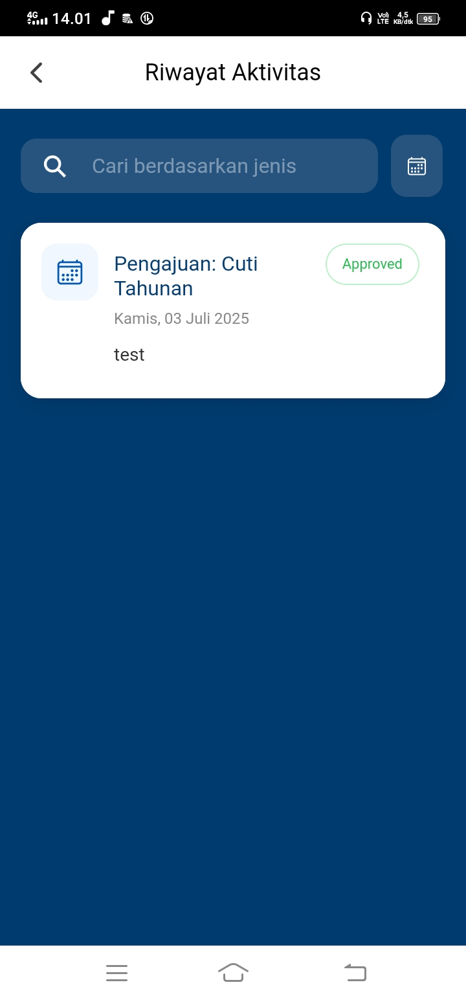

# SIPENA - Aplikasi Karyawan

**SIPENA (Sistem Informasi Pengelolaan Karyawan)** adalah aplikasi mobile android yang dibangun menggunakan **Ionic Framework** dan **Angular**. Aplikasi ini menjadi antarmuka utama bagi karyawan untuk mengakses dan berinteraksi dengan fitur sistem presensi, cuti, gaji, serta informasi terkait pekerjaan.

---

## 📚 Daftar Isi

- [✨ Fitur Utama](#-fitur-utama)
- [📸 Tampilan Aplikasi](#-tampilan-aplikasi)
- [🛠️ Teknologi yang Digunakan](#️-teknologi-yang-digunakan)
- [🚀 Panduan Instalasi & Konfigurasi](#-panduan-instalasi--konfigurasi)
- [📱 Menjalankan di Perangkat](#-menjalankan-di-perangkat)
- [📂 Struktur Proyek](#-struktur-proyek)

---

## ✨ Fitur Utama

- **🔐 Otentikasi Aman**
  - Login, logout, dan lupa password terintegrasi dengan backend API.

- **📊 Dasbor Dinamis**
  - Menampilkan status presensi, ringkasan sisa cuti, dan pengumuman terbaru.

- **📍 Presensi Cerdas**
  - Check-in & check-out dengan **foto** dan validasi **Geofencing**.
  - Deteksi otomatis keterlambatan dan waktu presensi sesuai jam kerja.

- **📝 Manajemen Mandiri (Self-Service)**
  - Pengajuan cuti yang tervalidasi dengan kuota cuti.
  - Riwayat dan slip gaji dapat dilihat dan diunduh (PDF).

- **📅 Pusat Informasi**
  - Riwayat presensi dan cuti dengan filter & pencarian.
  - Notifikasi dengan indikator pesan belum dibaca.

- **💎 UX Profesional**
  - Komponen UI kustom, skeleton loading, dan penanganan koneksi offline.

---

## 📸 Tampilan Aplikasi

- **Login**
  
  

- **Dasbor**

  

- **Presensi**

  

- **Riwayat**

  

---

## 🛠️ Teknologi yang Digunakan

- **Framework:** Ionic 7 + Angular 16+
- **Runtime Native:** Capacitor 5
- **Bahasa:** TypeScript
- **Styling:** SCSS
- **UI Toolkit:** Ionic Components

### 📦 Paket Utama

- `@capacitor/camera`: Akses kamera
- `@capacitor/geolocation`: Akses GPS
- `@capacitor/browser`: Buka tautan eksternal

---

## 🚀 Panduan Instalasi & Konfigurasi

### 1. Prasyarat

- Node.js (versi LTS)
- Ionic CLI (npm install -g @ionic/cli)
- Android Studio (untuk build ke Android)

### 2. Clone Repositori

```bash
git clone https://github.com/NAMA_ANDA/sipena-ionic-app.git
cd sipena-ionic-app
```

### 3. Install Dependensi

```bash
npm install
```

### 4. Konfigurasi Environment

Edit file:

```bash
src/environments/environment.ts
```

Isi dengan konfigurasi API Anda:

```ts
export const environment = {
  production: false,
  apiUrl: 'http://ALAMAT_IP_LOKAL_ANDA:8000/api',
  imageBaseUrl: 'http://ALAMAT_IP_LOKAL_ANDA:8000'
};
```

### 5. Jalankan di Browser

```bash
ionic serve
```

Aplikasi dapat diakses melalui: [http://localhost:8100](http://localhost:8100)

---

## 📱 Menjalankan di Perangkat

Untuk menguji fitur native seperti kamera, GPS, dan notifikasi, jalankan di perangkat atau emulator Android.

### 1. Tambahkan Platform Android

```bash
npx cap add android
```

### 2. Build Aplikasi

```bash
ionic build
```

### 3. Sinkronisasi ke Android

```bash
npx cap sync android
```

### 4. Buka di Android Studio

```bash
npx cap open android
```

Lanjutkan proses build & run dari Android Studio ke emulator/perangkat fisik.

---

## 📂 Struktur Proyek

| Folder/Path          | Deskripsi                                                |
| -------------------- | -------------------------------------------------------- |
| `src/app/pages`      | Halaman utama aplikasi (dashboard, login, presensi, dll) |
| `src/app/services`   | Service untuk komunikasi dengan API backend              |
| `src/app/components` | Komponen UI yang digunakan ulang                         |
| `src/theme`          | Styling global (mis. variables.scss)                     |
| `src/assets`         | Aset statis: gambar, logo, file terjemahan (i18n)        |

---

## 📄 Lisensi

Proyek ini menggunakan lisensi [MIT License](LICENSE).